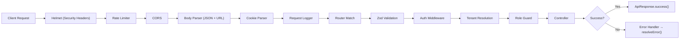
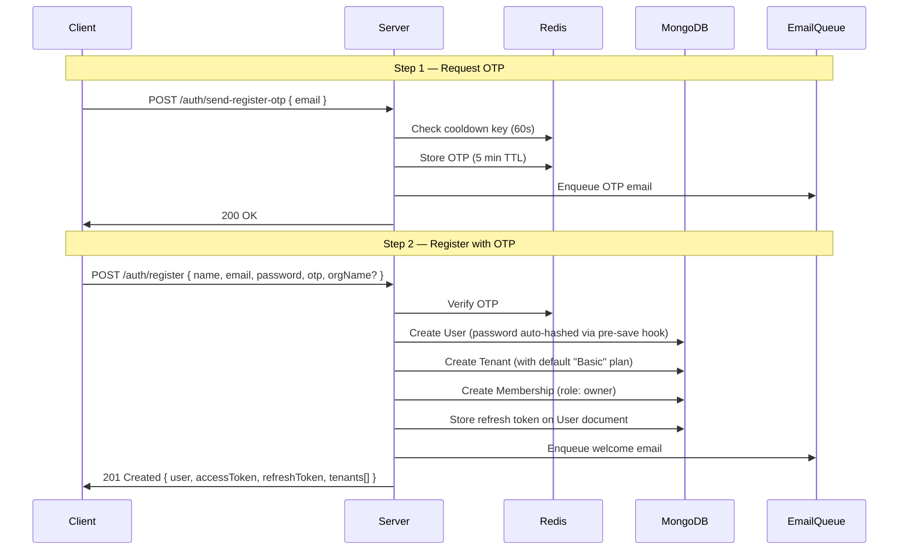
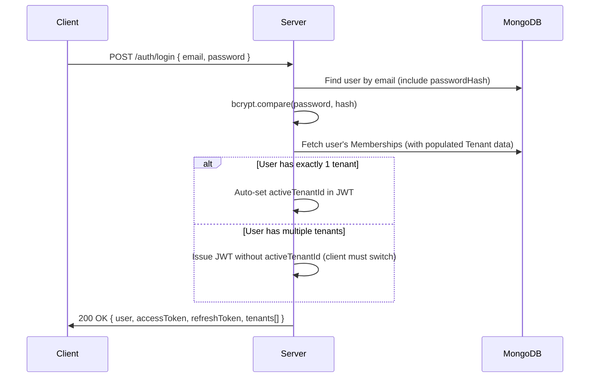
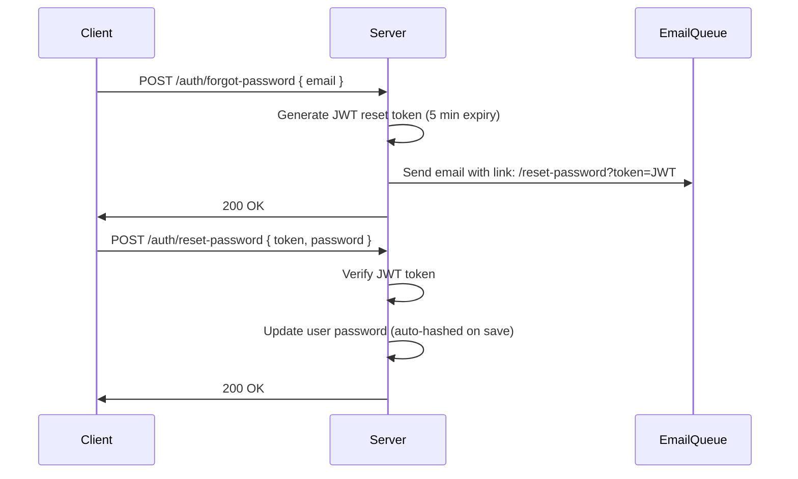
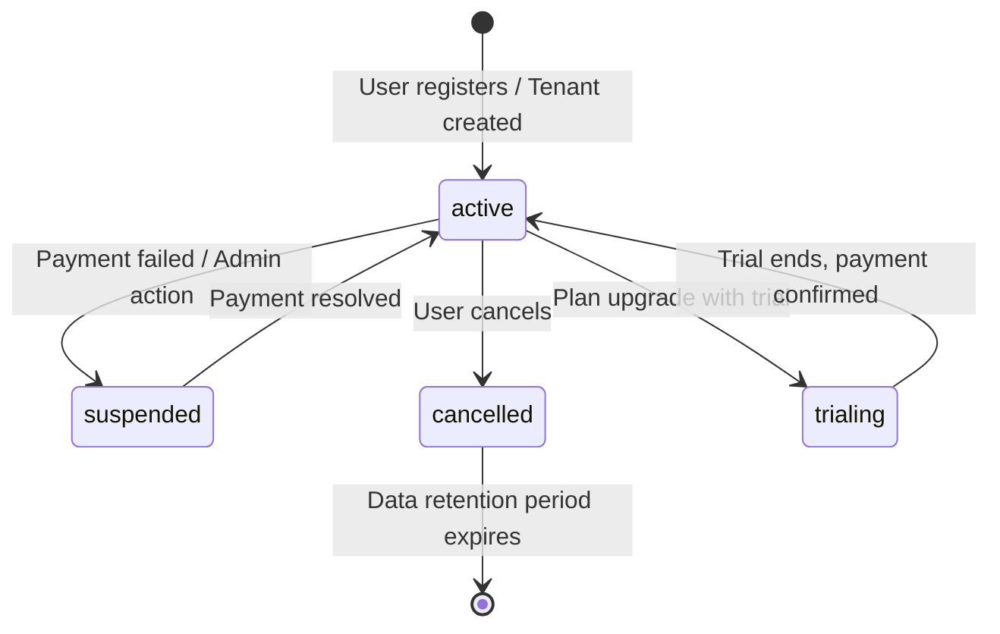
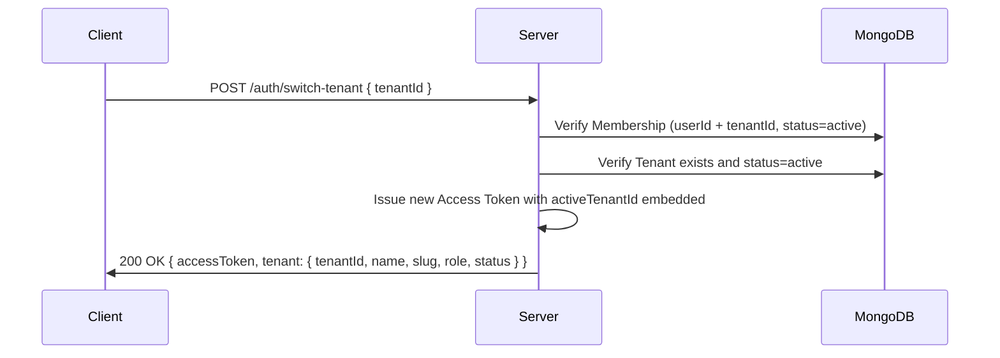
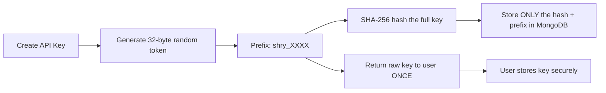
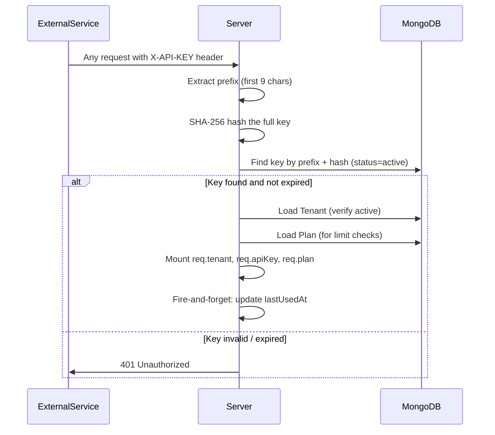
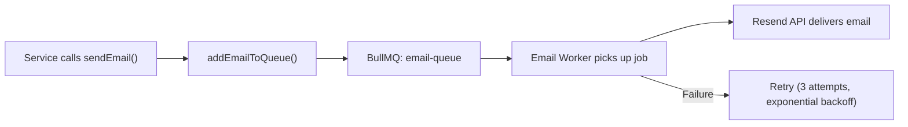

# SheryAssets — Server Architecture & Application Flow

> A comprehensive guide to the backend architecture, module design, request lifecycle, and every major business flow powering the SheryAssets platform.

---

## Table of Contents

- [Architecture Overview](#-architecture-overview)
- [Project Structure](#-project-structure)
- [Request Lifecycle](#-request-lifecycle)
- [Authentication & Authorization](#-authentication--authorization)
- [Multi-Tenancy Model](#-multi-tenancy-model)
- [Membership & Roles](#-membership--roles)
- [API Key Management](#-api-key-management)
- [Plans & Billing Limits](#-plans--billing-limits)
- [Error Handling Pipeline](#-error-handling-pipeline)
- [Email & Queue System](#-email--queue-system)
- [API Reference](#-api-reference)

---

## 🏗️ Architecture Overview

The server follows a **modular, layered** architecture built on top of:

| Technology | Purpose |
|---|---|
| **Bun** | JavaScript runtime (replaces Node.js) — used to run and watch the server |
| **Express** | HTTP framework — routing, middleware pipeline, request/response handling |
| **Mongoose** | MongoDB ODM — schema definitions, validation, hooks, data access |
| **ioredis** | Redis client — OTP storage, rate limiting, session cooldowns |
| **BullMQ** | Job queue — background email delivery with retries |
| **Winston** | Structured logging — file + console transports with correlation IDs |
| **Zod** | Schema validation — request body, query, and params validation |
| **jsonwebtoken** | JWT — access tokens, refresh tokens, password reset tokens |

### Core Layer Pattern

Every module follows a strict **5-layer separation**:

```
Route → Controller → Service → DAO → Model
```

| Layer | Responsibility | Example File |
|---|---|---|
| **Route** | Defines endpoints, wires validation + middleware + controller | `auth.route.ts` |
| **Controller** | Receives `req`/`res`, calls services, sends `ApiResponse` | `auth.controller.ts` |
| **Service** | Core business logic, orchestrates multiple DAOs and external services | `auth.service.ts` |
| **DAO** | Thin database abstraction — all Mongoose queries live here | `auth.dao.ts` |
| **Model** | Mongoose schema, indexes, hooks (e.g. password hashing) | `user.model.ts` |

> **Why this pattern?** Controllers never touch the database directly. Services never import `req`/`res`. DAOs never contain business logic. This makes each layer independently testable and swappable.

---

## 📂 Project Structure

```
src/
├── configs/          # Environment (ENV.ts), Redis connection, DB connection
├── middlewares/      # Cross-cutting: auth, tenant resolution, CORS, rate limiting,
│                     #   validation, error handling, API key auth
├── modules/
│   ├── Auth/         # Registration, login, logout, refresh, password reset, tenant switch
│   ├── User/         # User model & types (tenant-agnostic identity)
│   ├── Tenant/       # Organization model, CRUD, slug generation
│   ├── Membership/   # User↔Tenant link with roles (owner, admin, member)
│   ├── Plan/         # Subscription plans, limits, seeding
│   └── ApiKey/       # API key generation, hashing, resolution, revocation
├── queues/           # BullMQ queue definitions (email queue)
├── workers/          # BullMQ workers (email worker using Resend)
├── routes/           # Central router — mounts all module routers
├── utils/            # ApiError, ApiResponse, logger, error mapping, email helper
├── __tests__/        # Integration test suites (auth, tenant-membership)
├── app.ts            # Express app setup (middleware + routes + error handler)
└── server.ts         # Entry point — connects DB, seeds plans, starts HTTP server
```

---

## 🔄 Request Lifecycle

Every incoming HTTP request passes through the following pipeline:



**Key details:**

- **Request Logger** assigns a unique `requestId` (UUID v4) to every request for tracing.
- **Zod Validation** parses `body`, `query`, and `params` — invalid requests are rejected with structured field-level errors before the controller ever runs.
- **Auth / Tenant / Role** middlewares are only applied to routes that need them (not global).

---

## 🔐 Authentication & Authorization

SheryAssets uses **JWT-based authentication** with separate access and refresh tokens.

### Token Architecture

| Token | Secret | Lifetime | Contains | Storage |
|---|---|---|---|---|
| **Access Token** | `JWT_SECRET` | 5 minutes | `userId`, `email`, `activeTenantId?` | Client (cookie/header) |
| **Refresh Token** | `JWT_REFRESH_SECRET` | 7 days | `userId` | Client + hashed in MongoDB |
| **Reset Token** | `JWT_SECRET` | 5 minutes | `userId` | Sent via email link |

### 1. Registration Flow (OTP-Verified)

The registration flow creates three entities atomically: **User → Tenant → Membership**.



**Safeguards:**
- Email is normalized (`trim().toLowerCase()`) before any operation.
- A **60-second cooldown** prevents OTP spam.
- OTP is deleted from Redis immediately after successful verification.
- Duplicate email registration returns `409 Conflict`.

### 2. Login Flow



### 3. Token Refresh

```
POST /auth/refresh { refreshToken }
```
- Verifies the refresh token against `JWT_REFRESH_SECRET`.
- Looks up the user and confirms the stored refresh token matches.
- Issues a **new pair** of access + refresh tokens (rotation).
- Old refresh token is invalidated.

### 4. Password Reset



### 5. Logout

```
POST /auth/logout { refreshToken }   (requires auth)
```
- Clears the stored `refreshToken` on the User document.
- All previously issued refresh tokens become invalid.

---

## 🏢 Multi-Tenancy Model

SheryAssets uses a **Shared Database, Shared Schema** multi-tenancy approach. All tenants live in the same MongoDB database, distinguished by a `tenantId` field on tenant-scoped resources.

### What is a Tenant?

A **Tenant** represents an **organization or project workspace**. It is the central isolation boundary for:

- API Keys
- Usage limits and billing
- Team members
- All future resources (images, transformations, etc.)

### Tenant Schema

| Field | Type | Description |
|---|---|---|
| `name` | String | Organization display name |
| `slug` | String (unique) | URL-friendly identifier (auto-generated, uniqueness enforced) |
| `ownerUserId` | ObjectId → User | The user who created this tenant |
| `planId` | ObjectId → Plan | The subscription plan governing limits |
| `status` | Enum | `active`, `suspended`, `trialing`, `cancelled` |
| `billingEmail` | String | Email used for billing communications |

### Tenant Lifecycle



### How Tenant Context Works

For any tenant-scoped operation, the system needs to know **which tenant** the request is for.

**Two ways to provide tenant context:**

1. **Via JWT** — When a user calls `/auth/switch-tenant`, their new access token contains `activeTenantId`. The `authenticateUser` middleware automatically mounts this as the `x-tenant-id` header.
2. **Via Header** — The client can explicitly send `X-TENANT-ID: <tenantId>` header.

**The `resolveTenant` middleware then:**
1. Reads `tenantId` from the `x-tenant-id` header.
2. Verifies the Tenant exists and its `status === 'active'`.
3. Verifies the authenticated user has an `active` Membership in this Tenant.
4. Mounts `req.tenant` and `req.membership` for downstream use.

### Tenant API Endpoints

| Method | Endpoint | Auth | Description |
|---|---|---|---|
| `GET` | `/tenants/my-tenants` | JWT | List all tenants the user owns |
| `GET` | `/tenants/slug/:slug` | JWT | Fetch a specific tenant by its slug |

---

## 👥 Membership & Roles

A **Membership** is the join table between `User` and `Tenant`. A single user can be a member of multiple tenants with different roles in each.

### Membership Schema

| Field | Type | Description |
|---|---|---|
| `userId` | ObjectId → User | The member |
| `tenantId` | ObjectId → Tenant | The organization |
| `role` | Enum | `owner`, `admin`, `member` |
| `status` | Enum | `active`, `invited`, `removed` |
| `invitedBy` | ObjectId → User | Who invited this member (optional) |

### Role Permissions

| Capability | `owner` | `admin` | `member` |
|---|:---:|:---:|:---:|
| View tenant resources | ✅ | ✅ | ✅ |
| Create / use API keys | ✅ | ✅ | ❌ |
| Manage team members | ✅ | ✅ | ❌ |
| Revoke API keys | ✅ | ✅ | ❌ |
| Change tenant settings | ✅ | ❌ | ❌ |
| Delete tenant | ✅ | ❌ | ❌ |

> Roles are enforced by the `requireRole(['owner', 'admin'])` middleware. It reads the role from `req.membership` (set by `resolveTenant`), **not** from the User document.

### Membership API Endpoints

| Method | Endpoint | Auth | Tenant | Role | Description |
|---|---|---|---|---|---|
| `GET` | `/memberships/mine` | JWT | — | — | List all memberships for the current user |
| `GET` | `/memberships/tenant-members` | JWT | Required | `owner` / `admin` | List all members of the active tenant |

### Tenant Switching Flow



After switching, all subsequent requests with the new access token automatically carry the tenant context — no need to send `X-TENANT-ID` manually.

---

## 🔑 API Key Management

API Keys provide **machine-to-machine** authentication, allowing external services to interact with SheryAssets without a user session.

### Security Model



**Key principles:**
- The raw API key is **never stored** in the database — only its SHA-256 hash.
- The raw key is shown to the user **exactly once** at creation time.
- Keys are scoped to a Tenant (via `tenantId`).
- Keys can optionally have an `expiresAt` date.
- The `prefix` field (`shry_XXXX`) allows identifying which key is being used without exposing the secret.

### API Key Resolution (Incoming Request)



### API Key Endpoints

| Method | Endpoint | Auth | Tenant | Role | Description |
|---|---|---|---|---|---|
| `POST` | `/api-keys` | JWT | Required | `owner` / `admin` | Create a new API key |
| `GET` | `/api-keys` | JWT | Required | `owner` / `admin` | List all keys (hash excluded) |
| `PATCH` | `/api-keys/:keyId/revoke` | JWT | Required | `owner` / `admin` | Revoke a key (soft delete) |

---

## 📦 Plans & Billing Limits

Every Tenant is assigned a **Plan** that governs usage limits and feature access.

### Available Plans

| Plan | Code | Price/mo | Max Images | Bandwidth | API Keys | Transformations | Priority | Custom Domain | Eager Variants |
|---|---|---|---|---|---|---|:---:|:---:|:---:|
| **Basic** | `basic` | Free | 1,000 | 5 GB | 2 | 5,000 | ❌ | ❌ | ❌ |
| **Pro** | `pro` | $29 | 50,000 | 100 GB | 10 | 100,000 | ✅ | ✅ | ❌ |
| **Pay As You Go** | `payg` | Usage | Unlimited | Unlimited | 20 | Unlimited | ✅ | ✅ | ✅ |
| **Enterprise** | `enterprise` | $299 | Unlimited | Unlimited | 100 | Unlimited | ✅ | ✅ | ✅ |

> `-1` in limits means **unlimited** (no cap applied, billed by usage for PAYG).

### How Limits Are Enforced

1. **Server Startup** — `PlanService.seedDefaults()` upserts all 4 plans into MongoDB. Safe to run repeatedly (idempotent).
2. **At operation time** — Services (e.g., `ApiKeyService.create()`) fetch the Tenant's plan and compare current usage against `plan.limits.maxApiKeys` before allowing the operation.
3. **Via API Key middleware** — When authenticating via API key, the `authenticateApiKey` middleware loads and mounts `req.plan` for downstream limit checks.

### Plan Endpoints

| Method | Endpoint | Auth | Description |
|---|---|---|---|
| `GET` | `/plans` | Public | List all available plans with limits and pricing |

---

## 🔧 Error Handling Pipeline

All errors flow through a centralized pipeline that ensures consistent API responses.

### Error Flow

```
Thrown Error → asyncHandler catches → next(err) → errorHandler middleware
                                                       ↓
                                              resolveError(err)
                                                       ↓
                                              Match against ERROR_MAP
                                                       ↓
                                              { statusCode, message, errors[] }
```

### Error Map (Priority Order)

| Error Type | Status | Trigger |
|---|---|---|
| `ZodError` | 400 | Schema validation failure — returns field-level errors |
| `CastError` | 400 | Invalid MongoDB ObjectId format |
| Mongo Duplicate (code 11000) | 409 | Unique index violation (e.g., duplicate email) |
| `ValidationError` | 400 | Mongoose schema validation failure |
| `JsonWebTokenError` | 401 | Malformed or tampered JWT |
| `TokenExpiredError` | 401 | Expired JWT |
| `ApiError` | varies | Application-level thrown errors with custom status codes |

### Error Response Shape

```json
{
  "success": false,
  "message": "Validation failed",
  "errors": [
    { "field": "body.email", "message": "Valid email is required" },
    { "field": "body.password", "message": "Password must be at least 8 characters" }
  ],
  "stack": "..."  // Only in development
}
```

### Success Response Shape

```json
{
  "success": true,
  "message": "User registered successfully",
  "data": { ... },
  "meta": { ... }  // Optional metadata
}
```

---

## 📧 Email & Queue System

Emails are sent asynchronously using **BullMQ** + **Resend** to avoid blocking the request.



**Design decisions:**
- Email delivery is **non-blocking** — the API returns immediately while the email is processed in the background.
- Failed emails are retried up to **3 times** with exponential backoff (1s → 2s → 4s).
- The welcome email failure during registration is caught and logged but **does not** fail the registration itself.

---

## 📡 API Reference

### Auth Module (`/api/v1/auth`)

| Method | Endpoint | Auth | Body | Description |
|---|---|---|---|---|
| `POST` | `/send-register-otp` | — | `{ email }` | Send OTP to email for registration |
| `POST` | `/register` | — | `{ name, email, password, otp, orgName? }` | Register with OTP verification |
| `POST` | `/login` | — | `{ email, password }` | Login with credentials |
| `POST` | `/refresh` | — | `{ refreshToken }` | Rotate access + refresh tokens |
| `POST` | `/logout` | JWT | `{ refreshToken? }` | Clear refresh token |
| `GET` | `/me` | JWT | — | Get current user profile + tenants |
| `POST` | `/forgot-password` | — | `{ email }` | Send password reset email |
| `POST` | `/reset-password` | — | `{ token, password }` | Reset password with token |
| `POST` | `/switch-tenant` | JWT | `{ tenantId }` | Switch active tenant, get new JWT |

### Tenant Module (`/api/v1/tenants`)

| Method | Endpoint | Auth | Description |
|---|---|---|---|
| `GET` | `/my-tenants` | JWT | List tenants owned by current user |
| `GET` | `/slug/:slug` | JWT | Get tenant details by slug |

### Membership Module (`/api/v1/memberships`)

| Method | Endpoint | Auth | Tenant | Role | Description |
|---|---|---|---|---|---|
| `GET` | `/mine` | JWT | — | — | List current user's memberships |
| `GET` | `/tenant-members` | JWT | Required | `owner`/`admin` | List members of active tenant |

### API Key Module (`/api/v1/api-keys`)

| Method | Endpoint | Auth | Tenant | Role | Description |
|---|---|---|---|---|---|
| `POST` | `/` | JWT | Required | `owner`/`admin` | Create new API key |
| `GET` | `/` | JWT | Required | `owner`/`admin` | List tenant's API keys |
| `PATCH` | `/:keyId/revoke` | JWT | Required | `owner`/`admin` | Revoke an API key |

### Plan Module (`/api/v1/plans`)

| Method | Endpoint | Auth | Description |
|---|---|---|---|
| `GET` | `/` | Public | List all available plans |

### Health Check

| Method | Endpoint | Description |
|---|---|---|
| `GET` | `/api/v1/health` | Returns `{ success: true, message: "API is healthy" }` |
