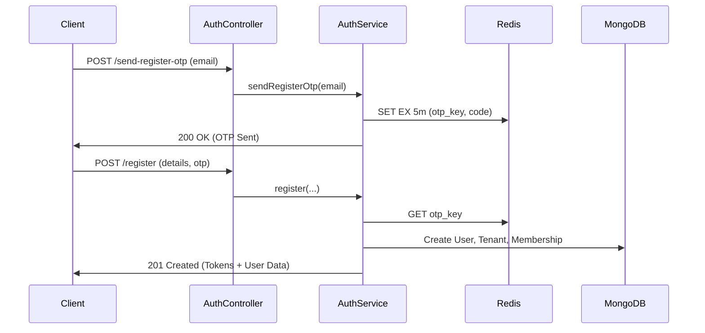

# System Architecture & Application Flow

This document provides a comprehensive overview of the **SheryAssets** server-side architecture, core modules, and key business logic flows.

---

## 🏗️ Architecture Overview

The server is built with a modular, layered architecture using **Bun**, **Express**, **Mongoose**, and **ioredis**.

### Core Layers:
- **Routes (`/routes`, `/modules/*/auth.route.ts`)**: Defines API endpoints and connects them to controllers.
- **Controllers (`/modules/*/auth.controller.ts`)**: Handles incoming requests, orchestrates services, and sends responses using `ApiResponse`.
- **Services (`/modules/*/auth.service.ts`)**: Contains core business logic, interacts with multiple DAOs, and handles external integrations (Redis, Email).
- **Data Access Objects (DAOs) (`/modules/*/auth.dao.ts`)**: Thin abstraction over Mongoose models for database operations.
- **Models (`/modules/*/auth.model.ts`)**: Mongoose schema definitions and hooks.
- **Middlewares (`/middlewares`)**: Cross-cutting concerns like Authentication, Multi-Tenancy, Rate Limiting, and Validation.

---

## 🔐 Authentication & Authorization Flow

SheryAssets uses a robust JWT-based authentication system with multi-tenancy support.

### 1. Registration Flow (OTP-Based)
1. **Request OTP**: User provides an email via `/auth/send-register-otp`.
2. **OTP Generation**: A 6-digit OTP is generated and stored in **Redis** with a 5-minute expiry.
3. **Email Delivery**: The OTP is sent to the user via Resend/BullMQ.
4. **Registration**: User submits registration details + OTP via `/auth/register`.
5. **Validation**: The system verifies the OTP from Redis and ensures the email is not already in use.
6. **Initialization**:
    - A new **User** is created.
    - A default **Tenant** (Organization) is created for the user.
    - A **Membership** is created, assigning the user as the `owner` of the new tenant.
    - High-level tokens (AccessToken, RefreshToken) are issued.

### 2. Login & Session Management
- **Standard Login**: Authenticates via email/password. Returns a JWT.
- **Tenant Switching**: Since a user can belong to multiple tenants, they must "switch" to a specific tenant to perform operations.
    - `/auth/switch-tenant` validates membership and issues a **Tenant-Scoped Access Token**.
    - This token contains the `activeTenantId` in its payload.

---

## 🏢 Multi-Tenancy Model

SheryAssets follows a **Shared Database, Shared Schema** multi-tenancy approach.

- **Tenant**: Represents an organization or project.
- **Membership**: Links a `User` to a `Tenant` with a specific `Role` (`owner`, `admin`, `member`).
- **Middleware Orchestration**:
    1. `authenticateUser`: Extracts and verifies the JWT.
    2. `resolveTenant`: Extracts `tenantId` (from header or token) and verifies the user has an active membership in that tenant.
    3. `requireRole`: Ensures the user's membership role satisfies the route requirements.

---

## 🔑 API Key Flow

Designed for machine-to-machine interaction.

1. **Generation**:
    - User creates a key via UI (`/api-keys`).
    - System generates a cryptographically secure raw token (`shry_...`).
    - Only the **SHA-256 Hash** of the key is stored in MongoDB.
    - **Crucial**: The raw key is shown only once to the user.
2. **Usage**:
    - Client sends `X-API-KEY` header.
    - `authenticateApiKey` middleware hashes the incoming key and looks up the document.
    - If found, it resolves the associated `Tenant` and `Plan`.

---

## 📦 Plan & Subscription Flow

Limits are enforced based on the Tenant's Plan.

- **System Startup**: Default plans (Basic, Pro, Pay-As-You-Go, Enterprise) are seeded into the database.
- **Enforcement**: Services (e.g., `ApiKeyService`) check plan limits before allowing operations.

---

## 🔧 Error Handling & Utilities

- **ApiError**: Standardized error class with status codes and structured field errors.
- **ApiResponse**: Static utility for consistent success responses.
- **Logger**: Winston-based logger with file-level granularity and correlation IDs.
- **Validation**: Zod-based schemas enforced via `validate` middleware at the route level.
