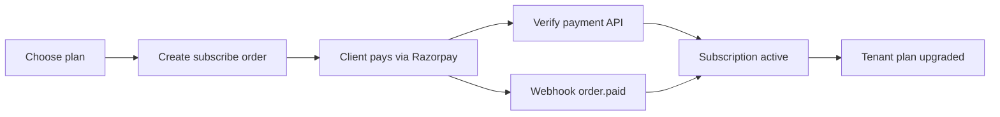

## Billing architecture

Billing uses plan selection, order intent creation, payment verification, and webhook confirmation.



## Endpoint map

| Method | Endpoint                           | Auth | Role         | Notes                                         |
| ------ | ---------------------------------- | ---- | ------------ | --------------------------------------------- |
| POST   | /api/v1/billing/subscribe/{planId} | Yes  | owner, admin | Creates Razorpay order intent                 |
| POST   | /api/v1/billing/subscribe/verify   | Yes  | owner, admin | Verifies signature and activates subscription |
| POST   | /api/v1/billing/webhook            | No   | Public       | Validates x-razorpay-signature                |

## Required tenant context

Billing routes are tenant-scoped. Tenant context is resolved by:

- activeTenantId in access token
- or X-TENANT-ID header

## Subscribe example

```bash
curl -X POST http://localhost:5000/api/v1/billing/subscribe/PLAN_ID \
  -H "Authorization: Bearer ACCESS_TOKEN" \
  -H "X-TENANT-ID: TENANT_ID" \
  -H "Content-Type: application/json" \
  -d '{}'
```

## Verify payment example

```bash
curl -X POST http://localhost:5000/api/v1/billing/subscribe/verify \
  -H "Authorization: Bearer ACCESS_TOKEN" \
  -H "X-TENANT-ID: TENANT_ID" \
  -H "Content-Type: application/json" \
  -d '{
    "orderId": "order_Q31k8jx9WJ9V0a",
    "paymentId": "pay_Q31lL9Vd2kacZs",
    "signature": "signature_from_gateway"
  }'
```

## Webhook notes

- Endpoint expects x-razorpay-signature header
- Invalid signature returns 400
- Duplicate order.paid events are handled idempotently

## Billing edge cases

| Scenario                                   | Status |
| ------------------------------------------ | ------ |
| Subscribe to basic plan through paid route | 400    |
| Existing active subscription on tenant     | 400    |
| Missing verify payload fields              | 400    |
| Invalid payment signature                  | 400    |
| Missing auth for protected billing routes  | 401    |
| Non owner or non admin role                | 403    |
| Plan not found                             | 404    |
| Subscription not found for verify          | 404    |

## Expected vs got with fixes

| Expected                    | Got                                 | Why                                    | How to fix                                          |
| --------------------------- | ----------------------------------- | -------------------------------------- | --------------------------------------------------- |
| Order created for paid plan | 400 basic plan cannot be subscribed | Basic plan is not a paid checkout flow | Use a non-basic plan id                             |
| Verify payment succeeds     | 400 payment verification failed     | Signature mismatch                     | Validate orderId, paymentId, signature from gateway |
| Verify payment succeeds     | 404 subscription not found          | Unknown orderId                        | Use orderId returned from subscribe endpoint        |
| Protected route access      | 403 forbidden                       | Caller is not owner/admin              | Use owner/admin token                               |
| Webhook accepted            | 400 invalid signature               | Wrong webhook secret                   | Verify webhook secret and header generation         |

## Debug order

1. Confirm access token validity
2. Confirm tenant context
3. Confirm role is owner/admin
4. Confirm plan id and order id values
5. Confirm Razorpay signature inputs

## Related pages

- /plans
- /troubleshooting
- /search-index

<Info>
  Open /api-reference for full schema-level billing request and response examples.
</Info>
