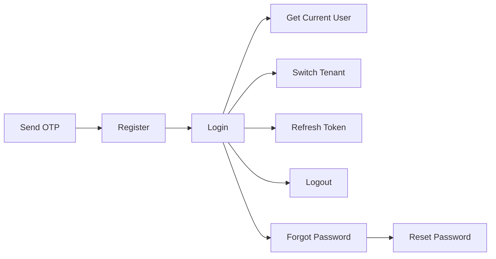

## Security schemes

Protected endpoints support:

- Bearer token in Authorization header
- accessToken cookie

Tenant-aware endpoints can additionally rely on:

- activeTenantId embedded in access token
- X-TENANT-ID request header

## Internal docs access

If INTERNAL_DOCS_ACCESS_TOKEN is configured on the server, access to /swagger.json
and /api-docs requires one of these:

- x-internal-docs-token header
- Authorization: Bearer `<INTERNAL_DOCS_ACCESS_TOKEN>`
- docs_token query parameter

## Auth flow map



## Endpoint map

| Method | Endpoint                       | Auth required | Purpose                          |
| ------ | ------------------------------ | ------------- | -------------------------------- |
| POST   | /api/v1/auth/send-register-otp | No            | Send registration OTP            |
| POST   | /api/v1/auth/register          | No            | Register user and default tenant |
| POST   | /api/v1/auth/login             | No            | Login and get tokens             |
| GET    | /api/v1/auth/me                | Yes           | Fetch current user profile       |
| POST   | /api/v1/auth/switch-tenant     | Yes           | Switch active tenant context     |
| POST   | /api/v1/auth/refresh           | No            | Rotate access and refresh token  |
| POST   | /api/v1/auth/forgot-password   | No            | Send password reset link         |
| POST   | /api/v1/auth/reset-password    | No            | Reset password with token        |
| POST   | /api/v1/auth/logout            | Yes           | Logout and invalidate session    |

## Example: login

```bash
curl -X POST http://localhost:5000/api/v1/auth/login \
  -H "Content-Type: application/json" \
  -d '{
    "email": "aaditya@sheryassets.com",
    "password": "Password123!"
  }'
```

## Example: get current user

```bash
curl http://localhost:5000/api/v1/auth/me \
  -H "Authorization: Bearer ACCESS_TOKEN"
```

## Common edge cases

| Scenario                                   | Status |
| ------------------------------------------ | ------ |
| Invalid email payload                      | 400    |
| Wrong OTP                                  | 400    |
| Duplicate email at register                | 409    |
| Invalid credentials                        | 401    |
| Missing access token on protected route    | 401    |
| Invalid or expired token                   | 401    |
| Switch tenant where user has no membership | 403    |
| OTP resend cooldown                        | 429    |

## Expected vs got with fixes

| Expected                  | Got                                | Why                              | Fix                                       |
| ------------------------- | ---------------------------------- | -------------------------------- | ----------------------------------------- |
| Login success with tokens | 401 invalid credentials            | Wrong email/password             | Recheck credentials or reset password     |
| Access protected endpoint | 401 access token missing           | Header/cookie absent             | Send Bearer token or cookie               |
| Switch tenant success     | 403 user does not belong to tenant | tenantId not in user memberships | Fetch tenant id from my-tenants and retry |
| OTP sent                  | 429 cooldown active                | Anti-spam window                 | Wait and retry                            |

## Developer shortcuts

- Use /api-reference for exact payload schemas
- Open API Auth group in /api-reference for generated endpoint-level examples
- Use /troubleshooting for status-code-first debugging
- Use /search-index to find endpoints quickly by keywords

<Info>
  For exact request and response examples, open /api-reference where every auth path
  includes generated examples and schemas.
</Info>
